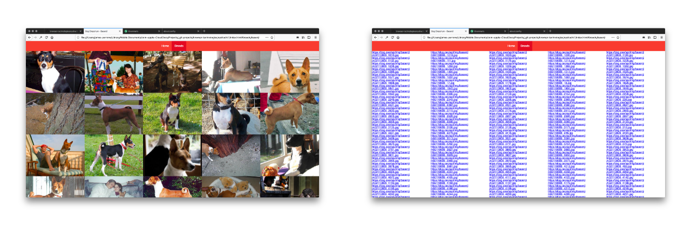

# Browser Technologies

Assignment 1.1 can be found by the name: [opdracht-1.1.key](https://github.com/Jamerrone/browser-technologies/blob/master/opdracht1/opdracht-1.1.key)

## [N] Feature 1 - Images
My JavaScript checks if the first 30 requested images are loaded or not. In case they are, it hides my loader. However, this also means that if the requested image is not loaded the users will be stuck in an infinite loop.

#### Fix:
I have added a 5-second timeout. The loader will automatically disappear after the given time. This will fix the infinite loop problem, however, I still need to somehow fix the broken images or at least hide them.

I have come up with a working solution. First of all, I have added an alt attribute to each image with the image source. Next, I wrapped each image in its own "a" tag. In case an image can't be loaded, the user is still able to visit the original URL using the alt attribute in combination with the "a" tag.

## [Y] Feature 2 - Internet
The dogs API used for this web application is by nature extremely fast. All the rendered images are small and optimized. Storing data in memory and cache limitates the number of requests and bandwidth needed.

#### Fix: Non needed.

## [Y] Feature 3 - Cookies
I didn't use cookies.

#### Fix: Non needed.

## [Y] Feature 4 - Fonts
My font stack contains only default system fonts.

#### Fix: Non needed.

## [Y] Feature 5 - Color
Tested for:
- Deuteranopia
- Deuteranomaly
- Protonopia
- Protonomaly
- Tritanopia
- Tritanomaly
- Grayscale

#### Fix: Non needed.

## [Y] Feature 6 - Local Storage
I didn't use local storage.

#### Fix: Non needed.

## [N] Feature 7 - JavaScript
Part of the wafs assignment was rendering HTML pages using JavaScript. This also means that if for whatever reason JavaScript is turned off or not supported, users will be staring at a blank page. Currently, I am unable to fix this issue, however, the fix should be rendering the HTML server side and not client side.

#### Fix: *TODO*: Render the HTML server side.

## [Y] Feature 8 - Mouse
Even though I didn't pay much attention to accessibility while developing the wafs website, it works surprisingly well with keyboard only inputs.

#### Fix: Non needed.
