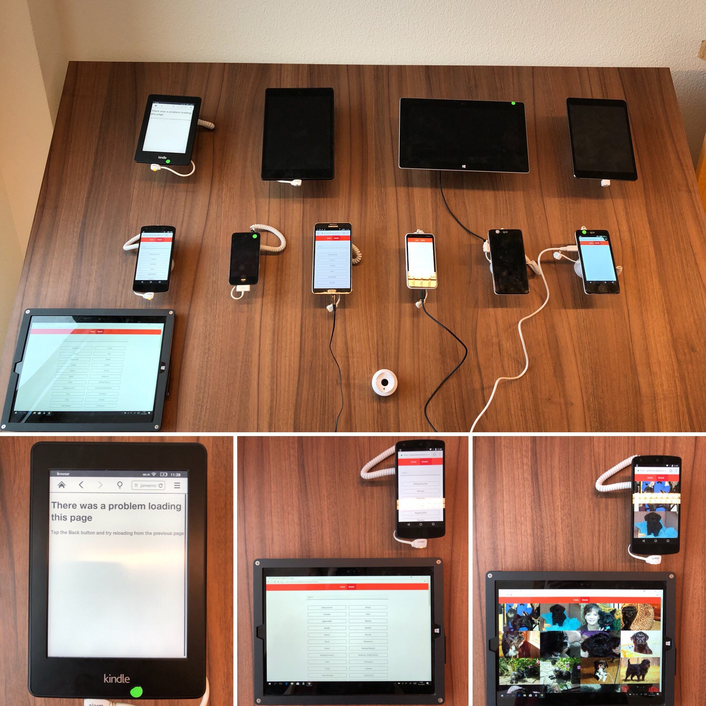

# Browser Technologies

Assignment 1.1 can be found here: [opdracht-1.1.key](https://github.com/Jamerrone/browser-technologies/tree/master/opdracht1)

## [N] Feature 1 - Images
My JavaScript checks if the requested images inside the viewport boundaries are loaded or not. If the checked images are loaded, my loader will be hidden. However, this also means that if the requested images are never loaded the user will get stuck in an infinite loop where the loader will never disappear.

#### Fixes:
I have added a 5-second timeout to my loader function. The loader will automatically disappear after the given timeout. This will fix the infinite loop problem, however, I still need to somehow fix the broken images or at least hide them for now.

I have come up with a working solution for the broken images. First of all, I have added an alt attribute to each image with the image source. Next, I wrapped each image in its own "a" tag. In case an image can't be loaded, the user is still able to visit the original URL using the alt attribute in combination with the "a" tag. It does not look pretty, however, it works.

## [Y] Feature 2 - Internet
The dogs API used for this web application is by nature extremely fast. All the rendered images are small and optimized. Storing data in memory and cache limitates the number of requests and bandwidth needed.

#### Fixes: Non needed.

## [Y] Feature 3 - Cookies
I didn't use cookies. :D

#### Fixes: Non needed.

## [Y] Feature 4 - Fonts
My font stack contains only default system fonts.

#### Fixes: Non needed.

## [Y] Feature 5 - Color
Tested for:
- [x] Deuteranopia
- [x] Deuteranomaly
- [x] Protonopia
- [x] Protonomaly
- [x] Tritanopia
- [x] Tritanomaly
- [x] Grayscale

#### Fixes: Non needed.

## [Y] Feature 6 - Local Storage
I didn't use local storage. :D (Memory and cache for the win!)

#### Fixes: Non needed.

## [N] Feature 7 - JavaScript
Part of the wafs assignment was rendering HTML pages using JavaScript. This also means that if for whatever reason JavaScript is turned off or not supported, users will be staring at a blank page. Currently, I am unable to fix this issue, however, the fix should be rendering the HTML server-side and not client-side.

#### Fixes: *TODO*: Render the HTML server side.

## [Y] Feature 8 - Mouse
Even though I didn't pay much attention to accessibility while developing the wafs website, it works surprisingly well with keyboard only inputs.

#### Fixes: Added some custom focus states.

## [Y] Device Lab

Just as expected multiple devices could not render my web application. However, the test results were worst then I originally expected. This made me realize how hard it is to support older devices and how important testing actually is. From now on I will always try to make use of testing opportunities given to me, for example, the device lab.

* The Nokia Windows phone and some other Chinese Android phone only rendered my navigation. I am not sure why but I think that they do not support JavaScript at all because the navigation is the only component not rendered my JavaScript.

* The Kindle did not render anything at all my guess is JS support (again).

* All other devices rendered my web app as normal and worked as expected.

**Passes:** 3 
**Fails:** 3

## [Y] Screen Reader (Mac Voice Over)
It works, however, the experience is very bad. The fact that my only content are images does not help. In order to fix feature "1" I added the image source in the alt attribute, this means that the screen reader will read every single alt. Most pages include over 200 images, you can imagine why the experience is bad. I will need to invest more time investigating this topic but I will leave this as a TODO for another time.
