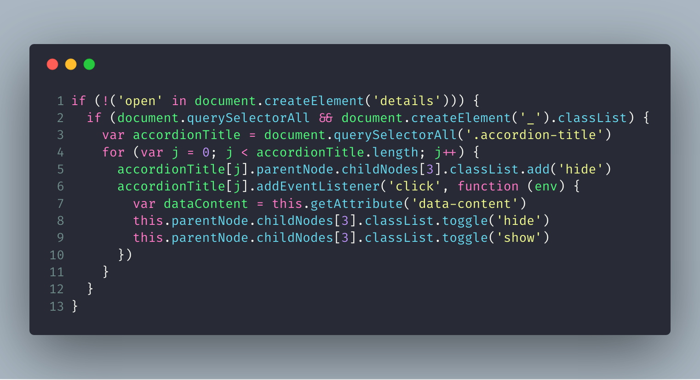
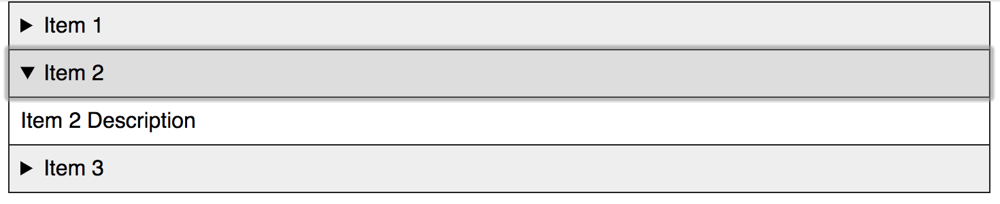
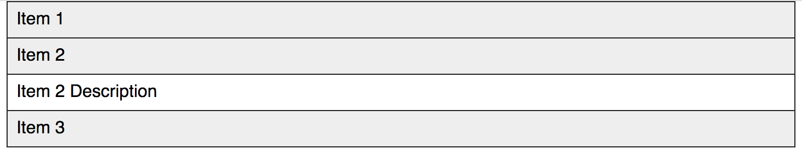
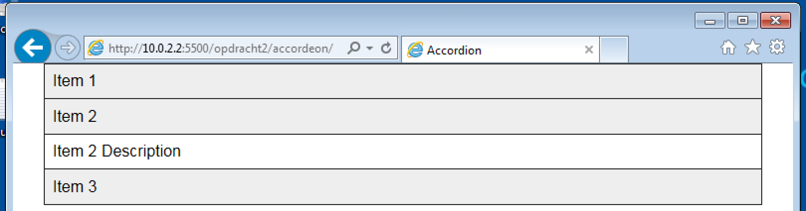
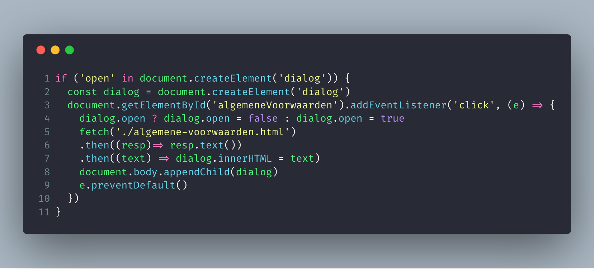
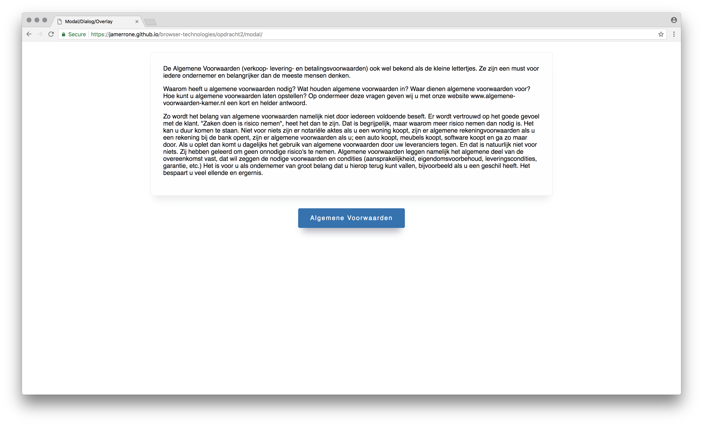
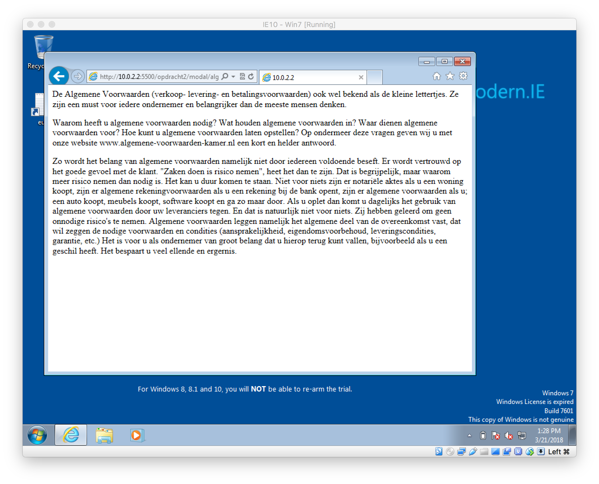

# Browser Technologies - Asigment 2

* GitHub pages for the: [Accordion / Details Tag]()
* GitHub pages for the: [Modal / Dialog Tag]()

**Warning:** *While I did style some elements, this was not my main focus during this assignment. Some elements may look odd or out of place, please ignore the oddities and focus on the functionality and progressive enhancements techniques used.*

## Accordion / Details Tag



For the accordion element, I chose to support as many browsers as I possibly could, including old Internet Explorer versions. The first step I took was creating an ```ol``` list with ```details``` tags for the actual accordion elements, each element had it's own ```summary``` and ```p``` element. The HTML 5 ```details``` tag adds out of the box functionality for building simple but interactive accordion menu's. Using a small amount of CSS you can style this tag any way you want.

However not every browser supports this new tag. Older browsers display a list with every accordion element under each other, with of course is not really a problem because any user, using any browser can still get their hands on the content they came for. In order to deliver an interactive and enjoyable experience to an as large group as possible, I used JavaScript to recreate the standard interaction for browsers that do not support the newly added tag.

The first thing I had to do in order to complete my goal was detecting whether the browser supported the ```details``` tag or not. Next, I checked if they supported ```querySelectorALL``` and ```classList```. I used the following code to check if the browser supported my required functionality:

```javascript
!('open' in document.createElement('details')) // Checks if the browser supports the details tag.
(document.querySelectorAll && document.createElement('_').classList) // Checks if the browser supports querySelectorAll & classList.
```

* **If they did support:** Great I can provide an enhanced user experience for users with browsers that do not support the ```details``` tag.
* **If they didn't support:** Well it is ok, users can still view the content but then in a list format rather then a fancy interactive accordion.

### Google Chrome

Default ```details``` tag behavior.


### Firefox & Internet Explorer 10

JavaScript enhanced behavior.



## Modal / Dialog Tag



For the Modal element, I used a completely different developing style. I chose to build something awesome for newer browsers that fully supported the ```dialog``` element and I provided an acceptable fallback for browsers that did not support it. After creating my semantic HTML files and after I added some simple CSS to it I began writing my JavaScript.

Current Google Chrome is the only browser that fully supports the ```dialog``` element. For this user group, I knew I could use other advanced and newer techniques like ```fetch``` without really checking for their support. The nice thing about this approach is the fact that when other browsers start supporting the new HTML element no code changes are required. When Google Chrome users click on the button a fancy popup is shown with the requested content. The content is fetched using ```fetch``` from another HTML file. This is great! It means that I can fetch any content from any page I want without having duplicated lines of code or content.

Users that use other unsupported browsers are linked to another page where the requested content can be found. This is also the page used for the ```fetch``` approach. With means that if the file is ever updated the changes are applied everywhere.

### Google Chrome

Fancy ```dialog``` + ```fetch``` experience.


### Other Browsers

100% working fallback.
