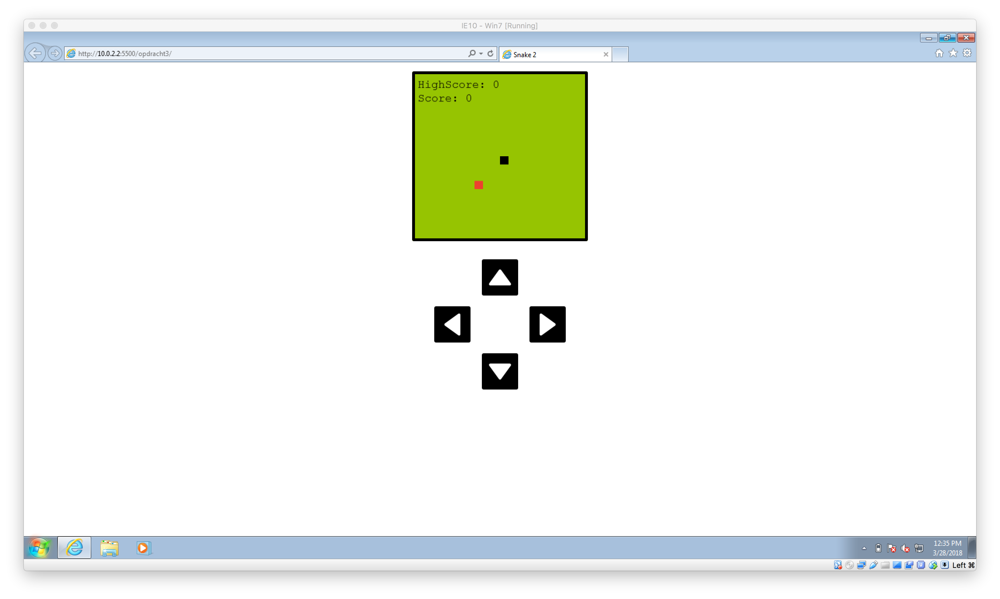
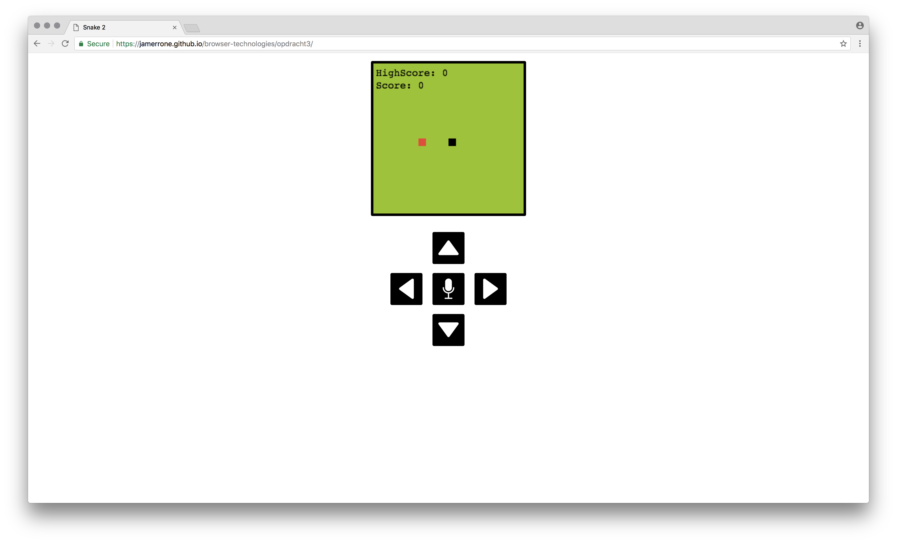
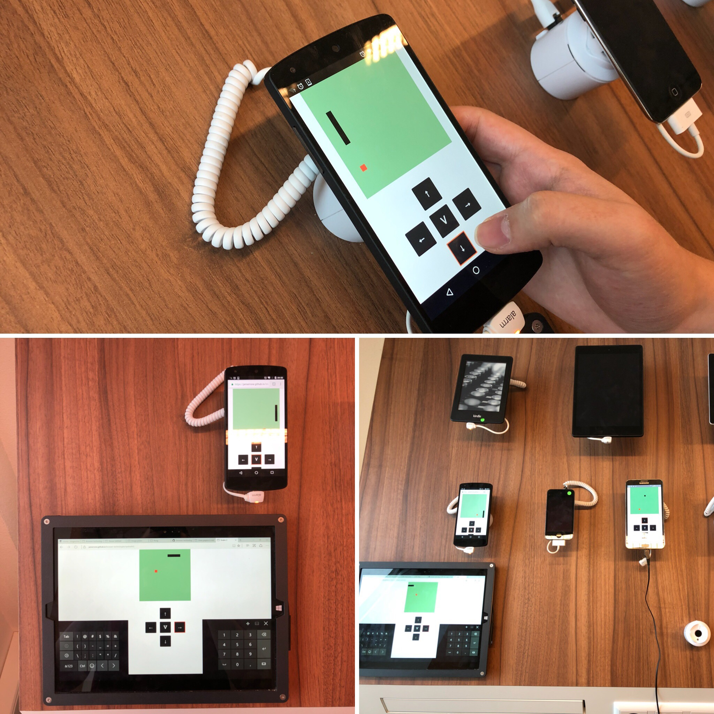
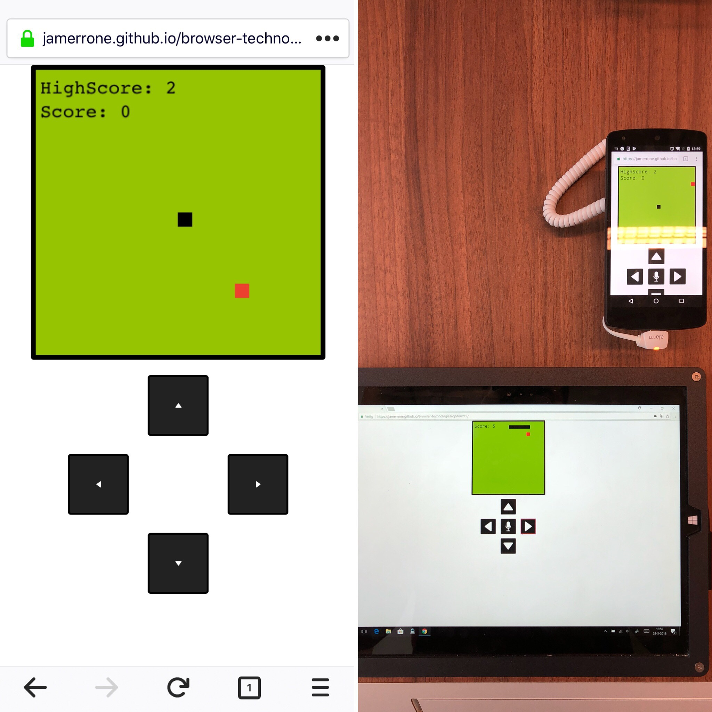

# Browser Technologies: Assignment 3

## Concept & Core Functionalities

For this assignment, I chose to build a retro-style snake game. I have spent quite a bit of time perfectionating the snake game mechanics and the different user input schematics. There are three possible control schemes that users can use depending on their device and/or disability.

The minimum requirements that a browser or device has to support in order for my concept to work are the HTML canvas element and some basic JavaScript. I choose to use a more old school javascript style in order to support as many users as possible, this, however, does not mean that I didn't use new technologies for devices that support them.

## Features & Browser Technologies

**Features:**
* Highscore system based on cookies
* Retro style game mechanics and looks
* On-screen controls for mobile devices
* Speech controls for advanced browsers
* Works on a large number of devices
* Keyboard support

**Browser Technologies:**

* HTML, CSS & JavaScript
* The canvas element
* Client side cookies
* Spech recornision Web API

## Support & Browsers

I have tried to support as many users as possible. Users using the keyboard, can, for example, control their snake using the arrow keys. Mobile users, however, don't have a physical keyboard, for them, I created a digital control schemes that works just like a joystick or the arrow keys from a regular keyboard. Even users that can't control the mouse or keyboard with precision can still have fun playing the game, they can, for example, play the game using their voice on Google Chrome or Android devices.

Voice input has a small delay and in order to keep the game fun for people that chose the voice as there primary input I have slowed down the game by 50%. This will make the game a bit easier and the delay won't be such a pain.

The speech recognition API is extremely new and not well support. The current support is actually 0%. The only way to get it working on Android devices and Google Chrome is using the webkit prefix. Using feature detection I can prevent the game from breaking on devices that do not support this technology. The voice input control will simply disappear for browsers without support. The high score works almost the same. If cookies are not supported or turned off, the game will still play as normal but there will be no high score displayed on the screen. The missing features will not be missed by users because they will never know that they even exist.

## Screenshots

